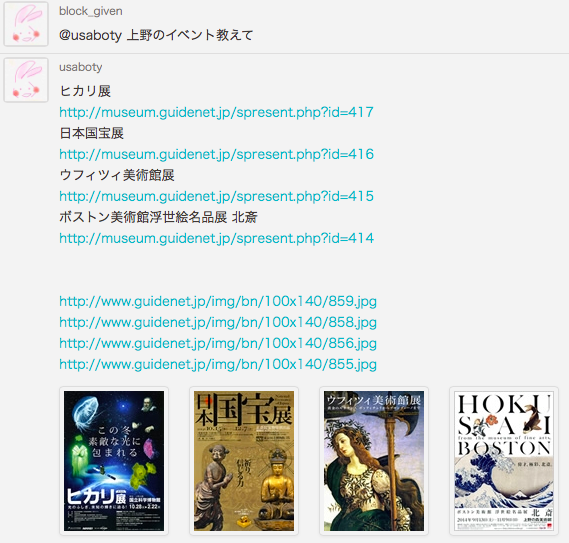

# Ruboty::UenoParkEvent

ruboty plugin for Ueno park event.



## Support

- [x] [ueno park museum event](http://museum.guidenet.jp/)
- [ ] [ueno park event](http://www.kensetsu.metro.tokyo.jp/toubuk/ueno/index_top.html)

## Installation

Add this line to your application's Gemfile:

```ruby
gem 'ruboty-ueno_park_event'
```

And then execute:

    $ bundle

Or install it yourself as:

    $ gem install ruboty-ueno_park_event

## Usage

    @ruboty 上野のイベント教えて

## Contributing

1. Fork it ( https://github.com/blockgiven/ruboty-ueno_park_event/fork )
2. Create your feature branch (`git checkout -b my-new-feature`)
3. Commit your changes (`git commit -am 'Add some feature'`)
4. Push to the branch (`git push origin my-new-feature`)
5. Create a new Pull Request
